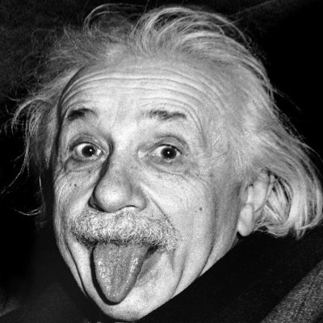
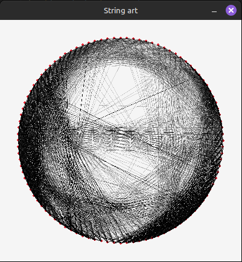

# Introduction

An attempt to make string art with raylib-go and golang. My image did not turn out as good as Patt:s, so there is probably a bug somewhere.

Inspired by Patt Vira:s [String Art video](https://www.youtube.com/watch?v=qH7ZgQghKUU), where she used p5.js. See link below.

# Pictures

Original:

Stringified:

# Links

- [Patt Vira:s video](https://www.youtube.com/watch?v=qH7ZgQghKUU)
- [raylib-go](https://github.com/gen2brain/raylib-go)
- [golang](https://golang.org/)
